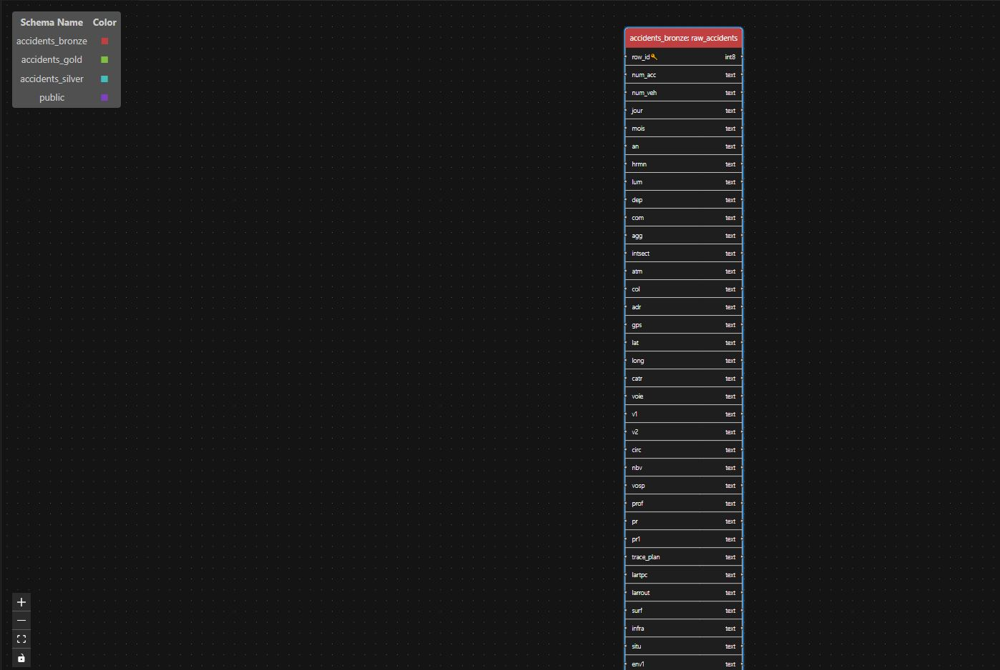
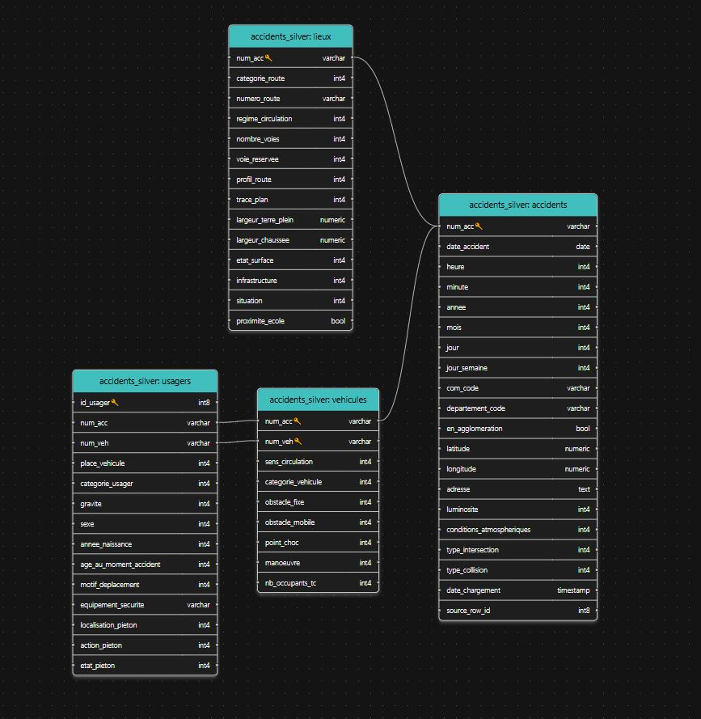
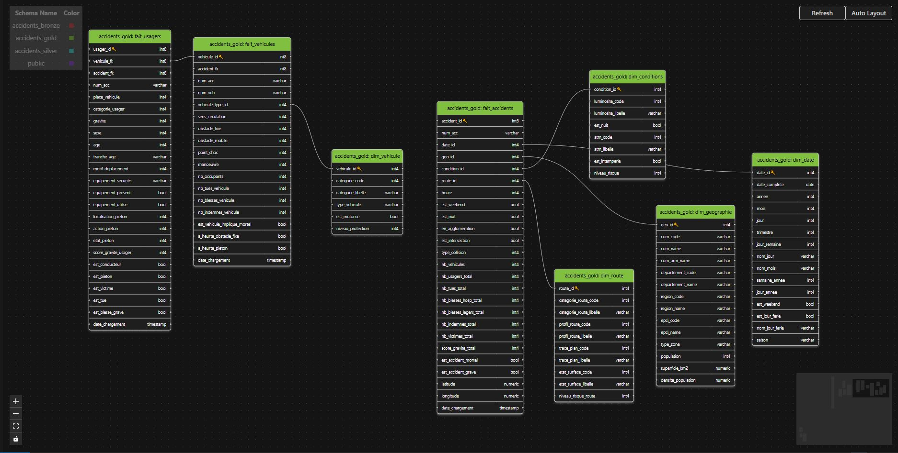
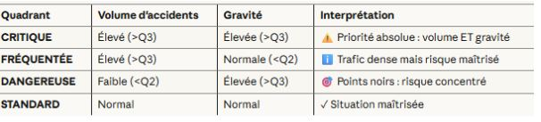

# 🚗 Projet Accidents Corporels - Base de Données Analytique

> **Objectif** : Conception d'une base de données centralisée pour l'analyse des accidents corporels de la circulation routière en France (données BAAC 2012-2019)

---

## 📋 Table des Matières

1. [Contexte et Objectifs](#-contexte-et-objectifs)
2. [Architecture & Workflow Global](#-architecture--workflow-global)
3. [Workflow d'Ingestion](#-workflow-dingestion)
   - [Extraction depuis l'API](#1-extraction-depuis-lapi)
   - [Ingestion dans la couche Bronze](#2-ingestion-dans-la-couche-bronze)
   - [Construction de la couche Silver](#3-construction-de-la-couche-silver)
   - [Ingestion dans la couche Silver](#4-ingestion-dans-la-couche-silver)
4. [Construction de la Couche Gold](#-construction-de-la-couche-gold)
   - [Tables de Dimensions](#41-tables-de-dimensions)
   - [Tables de Faits](#42-tables-de-faits)
5. [Points d'Amélioration](#-points-damélioration)
6. [Installation et Usage](#-installation-et-usage)

---

## 🎯 Contexte et Objectifs

### Mission

Concevoir une base de données pour un **observatoire régional de la sécurité routière**, permettant d'analyser les accidents corporels et d'identifier les facteurs de risque.

### Questions Métier Clés

1. **Zones à risque** : Quelles communes/départements ont le plus d'accidents graves ?
2. **Conditions critiques** : Quelles combinaisons (météo + luminosité + type de route) sont les plus dangereuses ?
3. **Tendances temporelles** : Y a-t-il des semaines anormales avec pics d'accidents ?
4. **Profils de victimes** : Quels types d'usagers sont les plus vulnérables ?

### Source de Données

- **API-Opendatasoft** : [Ministère de l'Intérieur - Base Nationale des Accidents Corporels (BAAC)](https://public.opendatasoft.com/explore/assets/accidents-corporels-de-la-circulation-millesime/)
- **Période** : 2012-2019
- **Format** : Parquet → PostgreSQL
- **Volume** : **475k de lignes**

---

## 🏗️ Architecture & Workflow Global

### Définition de l'Architecture

Nous avons adopté une **architecture Medallion en 3 couches** inspirée des pratiques Databricks et Data Lakes modernes :

```
┌─────────────────────────────────────────────────────────────────┐
│                      ARCHITECTURE MEDALLION                     │
└─────────────────────────────────────────────────────────────────┘

        API Opendatasoft (Request - methode get)
           │
           ├─► Parquet brut 
           │
           ▼
   ┌──────────────────┐
   │  COUCHE BRONZE   │  ← Données brutes (staging)
   │  (Staging Zone)  │     - 1 table : raw_accidents
   └────────┬─────────┘     - 69 colonnes TEXT
            │                - Aucune transformation
            │
            ▼
   ┌──────────────────┐
   │  COUCHE SILVER   │  ← Données nettoyées et normalisées
   │  (Snowflake 3NF) │     - 4 tables : accidents, lieux, vehicules, usagers
   └────────┬─────────┘     - Foreign Keys strictes
            │                - Types validés (DATE, INTEGER, BOOLEAN)
            │
            ▼
   ┌──────────────────┐
   │   COUCHE GOLD    │  ← Modèle analytique optimisé
   │  (Constellation) │     - 5 dimensions (date, géographie, conditions, route,
   |                  |       véhicule)
   └──────────────────┘     - 3 faits (accidents, véhicules, usagers)
                             - Métriques pré-calculées
```
### Schémas : 



### Principes de Modélisation

| Couche | Modèle | Objectif | Usage |
|--------|--------|----------|-------|
| **Bronze** | Table unique (staging) | Traçabilité totale | ETL, rejeu des transformations |
| **Silver** | Snowflake (3NF) | Intégrité référentielle | Requêtes transactionnelles, validation |
| **Gold** | Constellation | Performance analytique | Dashboards BI, requêtes OLAP |

### Workflow Global : Répartition des Tâches

Notre équipe de 3 apprentis data engineers s'est répartie les tâches selon ce workflow :

```
┌────────────────────────────────────────────────────────────────┐
│                    RÉPARTITION DES TÂCHES                      │
└────────────────────────────────────────────────────────────────┘

📥 INGESTION (Mathieu)
   ├─ Extraction API Opendatasoft
   ├─ Lecture du fichier Parquet
   └─ Source code : notebook/etl_accidents.ipynb| notebook/ressources

🧹 TRANSFORMATION SILVER (David)
   ├─ Nettoyage et validation des types
   ├─ Normalisation 3NF (4 tables)
   ├─ Gestion des FK et contraintes
   └─ source code : à définir

⭐ MODÉLISATION GOLD (Ali-Mathieu)
   ├─ Conception du schéma constellation
   ├─ Construction de 4 dimensions de la couche Gold
   |                    (dim_condition,dim_vehicule,dim_date et dim condition)
   |
   ├─ Construction des 1 dimensions de la couche Gold (dim_geographie)
   ├─ Construction des 3 tables de faits (fait_accidents,fait_vehicules et
   |                                       fait usagers)
   ├─ Scripts SQL : sql/
   └─ Script Python : notebook/etl_accidents.ipynb| notebook/ressources | 
                        notebook/transformation_gold.ipynb

📊 VALIDATION & DOCUMENTATION (Tous)
   ├─ Tests de cohérence des données
   ├─ Requêtes métier
   └─ Création de la Documentation
```

---

## 🔄 Workflow d'Ingestion

### 1. Extraction depuis l'API

**Responsable** : Mathieu

**Source** : API Opendatasoft - Base BAAC (Bulletins d’Analyse des Accidents Corporels)

**Processus** :</br>
* Pour l’extraction des données nous avons utilisé le package Python `requests` pour faire une requête HTTP `GET` sur l’endpoint `/catalog/datasets/{dataset_id}/exports/parquet`.

>* **A noter** : les politiques de contrôle de débit en place sur l’API d’OpenData ne nous ont permis de récupérer le fichier qu’en un seul coup. Côté format de fichier, nous avons opté pour l’utilisation du format parquet pour optimiser les temps de traitement.


**Output** :
- Fichier : `accidents_raw.parquet`
- Volume : ~475911 de lignes × 69 colonnes

**Script** : `notebook/etl_accidents.ipynb` *(géré par collègue 1)*

---

### 2. Ingestion dans la Couche Bronze

* **Responsable** : Mathieu

* **Objectif** : Charger les données brutes dans PostgreSQL sans transformation, pour traçabilité.
* **Explication** : Une fois le dataset extrait, on utilise le package `SQLAlchemy` de python pour pouvoir initier l’ingestion des données dans une seule et unique table brute, le but étant par la suite d’utiliser cette table pour pouvoir récupérer les colonnes nécessaires à la construction de chaque table des couches suivants Silver et Gold.

**Structure Bronze** :

```sql
-- Schema : accidents_bronze
-- Table : raw_accidents

CREATE TABLE accidents_bronze.raw_accidents (
    row_id BIGSERIAL PRIMARY KEY,           -- Clé technique
    load_timestamp TIMESTAMP DEFAULT NOW(), -- Horodatage du chargement
    
    -- 84 colonnes en type TEXT (données brutes)
    num_acc TEXT,
    jour TEXT,
    mois TEXT,
    an TEXT,
    hrmn TEXT,
    lum TEXT,
    dep TEXT,
    com TEXT,
    -- ... (80 autres colonnes)
);
```
---

### 3. Construction de la Couche Silver

**Responsable** : David

* **Objectif** : Normaliser les données en modèle 3NF (Flocon) avec validation des types et contraintes.

* **Explication** : La couche Silver constitue la première étape de nettoyage et de normalisation des données brutes.À partir de la table unique de la couche Bronze, nous avons appliqué un processus ETL optimisé pour transformer les données en 4 tables relationnelles.

**Structure Silver** : 4 tables normalisées

#### Table Créées: 

* `accidents`**(Table Centrale)** : Informations générales sur chaque accident (temporalité, localisation, conditions) 
    * **Grain** : 1 ligne = 1 accident corporel

* `lieux` **(relation 1:1 avec accidents)** : Caractéristiques détaillées du lieu (type de route, infrastructure, surface) 
    * **Grain** : 1 ligne = 1 lieu

* `vehicules` **(relation N:1 avec accidents)**: Données sur les véhicules impliqués (catégorie, manœuvre, obstacles) 
    * **Grain** : 1 ligne = 1 véhicule

* `usagers`**(relation N:1 avec vehicules)** : Informations sur les personnes impliquées (âge, gravité, équipement de sécurité)
    * **Grain** : 1 ligne = 1 usager


#### Transformations appliquées 

* **Explosion des colonnes multi-valeurs** : Transformation vectorisée des données agrégées (un accident → plusieurs véhicules/usagers)

* **Normalisation des données** : Application de mappings pour standardiser les valeurs catégorielles

* **Nettoyage** : Gestion des valeurs manquantes, aberrantes et des formats inconsistants

* **Typage fort**: Conversion en types de données appropriés (Int64, Float)

#### Optimisations techniques 

* **Vectorisation complète :** Opérations vectorisées pandas

* **Chargement sélectif :** Lecture uniquement des colonnes nécessaires 

* **Traitement par chunks :** Gestion optimisée de la mémoire pour les gros volumes


### 4. Ingestion dans la Couche Silver

**Responsable** : David

**Explication** : Une fois les transformations effectuées, les 4 DataFrames sont chargés dans PostgreSQL via `SQLAlchemy` avec les optimisations suivantes :

**Processus d'ingestion** :

1. **Vidage des tables existantes :** TRUNCATE CASCADE pour garantir la fraîcheur des données
2. **Insertion par batches :** Chargement optimisé par lots de 5000 lignes (method='multi')
3. **Gestion des erreurs :** Try/catch avec rollback automatique en cas d'échec

**Configuration** :
- **Moteur** : SQLAlchemy avec pool de connexions (pool_pre_ping=True)
- **Format** : Insertion directe depuis pandas (to_sql)
- **Logging** : Traçabilité complète des opérations dans etl_logs.txt

---

## ⭐ Construction de la Couche Gold

Les tables Gold ont été créées via les scripts du dossier `sql/03_Gold/`.
La prochaine étape a donc été de transformer les données et de les insérer dans ces tables.

### Transformation/Chargement des tables : Partie 1

**Responsable** : Ali

**Description** : Construction de la dimension géographie et des 3 tables de faits (fait_accidents, fait_vehicules, fait_usagers).

### Transformation/Chargement des tables : Partie 2

**Responsable** : Mathieu

Cette partie a été traitée par Mathieu, notamment pour les tables suivantes :
- `dim_conditions`
- `dim_vehicule`
- `dim_route`
- `dim_date`

Pour cette partie, des requêtes SELECT sont utilisées afin de récupérer les colonnes nécessaires au remplissage des nouvelles tables Gold, après avoir effectué de multiples transformations sur les données en question.

Afin de limiter la quantité de code dans les cellules, des fichiers Python et JSON ont été utilisés pour établir des mappings entre libellés de valeur et code valeur ; le but étant de remplir les nouvelles colonnes qui n'existaient pas dans la table RAW de la couche Bronze.

---

## 📊 Analyses Métier

Une fois les tables Gold constituées, nous avons développé **3 analyses métier clés** pour extraire des insights actionnables sur la sécurité routière. Ces analyses répondent à des questions stratégiques en matière de prévention.

### Stack Technique

- **Moteur de requêtes** : PostgreSQL avec requêtes SQL optimisées (CTE, Window Functions)
- **Orchestration** : Python (SQLAlchemy, Pandas)
- **Configuration** : Variables d'environnement (.env) pour sécurité
- **Logging** : Traçabilité complète des analyses avec horodatage
- **Dictionnaires de référence** : Utilisation de mappings Python pour transformer les codes numériques en libellés métier lisibles (conditions atmosphériques, luminosité, gravité, etc.)

### Critère 1 : Conditions à Risque Élevé

**Question métier** :
Quelles combinaisons de conditions (météo × luminosité × type de route × état de surface) présentent un risque significativement supérieur à la moyenne nationale ?

**Méthodologie** :
- Calcul du taux de mortalité national comme référence (base 100)
- Agrégation par combinaisons de 4 facteurs (conditions atmosphériques, luminosité, catégorie de route, état de surface)
- Filtrage sur seuil de significativité : minimum 50 accidents par combinaison
- Calcul du ratio de surmortalité : comparaison au taux national
- Classification des risques :
  - **TRÈS DANGEREUX** : taux > 3× la moyenne nationale
  - **DANGEREUX** : taux > 2× la moyenne
  - **RISQUE ÉLEVÉ** : taux > 1.5× la moyenne

**Output** : Top 20 des combinaisons les plus dangereuses avec scoring de risque

### Critère 2 : Zones Fréquentées vs Zones Dangereuses

**Question métier** :
Les zones avec beaucoup d'accidents sont-elles réellement plus dangereuses, ou simplement plus fréquentées ? Comment identifier les zones prioritaires pour les actions de prévention ?

**Méthodologie** :
- Calcul de 2 indicateurs par département :
  - **Volume** : nombre total d'accidents
  - **Gravité** : taux d'accidents graves (tués + blessés hospitalisés)
- Segmentation en 4 quadrants via analyse quartiles (Q2, Q3)

**Typologie des zones** :
- **Zone TRÈS PRIORITAIRE** : Fort volume + Forte gravité
- **Zone DANGEREUSE** : Faible volume + Forte gravité  
- **Zone FRÉQUENTÉE** : Fort volume + Faible gravité
- **Zone SOUS SURVEILLANCE** : Faible volume + Faible gravité


**Output** : Classification de tous les départements avec double classement (rang volume + rang gravité)

### Critère 3 : Analyse par Catégorie d'Usagers

**Question métier** :
Quelles catégories d'usagers sont les plus vulnérables ? Quel est leur niveau de surrisque par rapport à la moyenne ?

**Méthodologie** :
- Calcul du taux de mortalité global (tous usagers confondus)
- Statistiques détaillées par catégorie d'usager :
  - Nombre total d'usagers impliqués
  - Décompte par gravité (tués, blessés hospitalisés, blessés légers, indemnes)
  - Taux de mortalité et taux de gravité
  - Ratio de vulnérabilité : comparaison au taux global
- Seuil de significativité : minimum 100 usagers par catégorie
- Classification de vulnérabilité :
  - **TRÈS VULNÉRABLE** : taux > 3× la moyenne globale
  - **VULNÉRABLE** : taux > 2× la moyenne
  - **À RISQUE** : taux > 1.5× la moyenne

**Output** : Classement des catégories par taux de mortalité avec scoring de vulnérabilité

---

## 🚀 Points d'Amélioration

- **Orchestration du pipeline ETL avec Apache Airflow** : automatisation des flux Bronze → Silver → Gold, planification quotidienne et monitoring visuel.

- **Optimisation des performances PostgreSQL** : partitionnement par année, index composites et vues matérialisées pour accélérer les requêtes.

